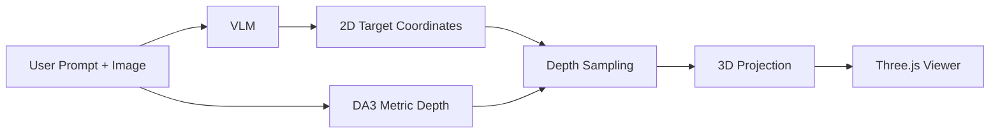

# Odyseus Spatial VLM

I've been recently fascinated by the possibilites provided by recent advancements in monocular depth estimation models and decided to expeirment combining them with a capable VLM, so below is an example demo to get 3D outputs from a VLM that can be more useful for a physical AI agent.

Quick Live Demo 👉 [app.odyseus.xyz](https://app.odyseus.xyz)

Or follow the setup on this repo for custom deployment

## Setup

This repo is currently set up primarily for Linux.

If you clone this as a git repo, prefer pulling the external DA3 dependency as a submodule:

```bash
git clone --recurse-submodules https://github.com/MercuriusTech/Odyseus-Spatial-VLM.git
cd spatial-vlm
```

If you already cloned without submodules:

```bash
git submodule update --init --recursive
```

If you are packaging this repo yourself, `Depth-Anything-3/` is intended to track the upstream project as a submodule.

Set up the VLM environment:

```bash
./setup-vlm.sh
```

Set up the depth demo environment:

```bash
./setup.sh
```

## Run

Start the VLM server:

```bash
./run-vlm.sh
```

Start the depth demo:

```bash
./run.sh
```

Then open:

```text
http://localhost:8080
```

## Hosted Demo


The local repo remains the reference implementation for running and modifying the demo yourself.

## Use

1. Upload an image.
2. Enter a prompt like `select the chair near the desk and the closest door`.
3. Click `Run Demo`.
4. Inspect:
   - the 2D target overlay
   - the 3D point cloud
   - labeled 3D targets
   - the camera frustum and guide vectors

## Flow



## Notes

- Linux is the best-supported path right now.
- PowerShell / Windows setup help is welcome. Contributions for improving `setup-vlm.ps1` or adding fuller Windows support are encouraged.
